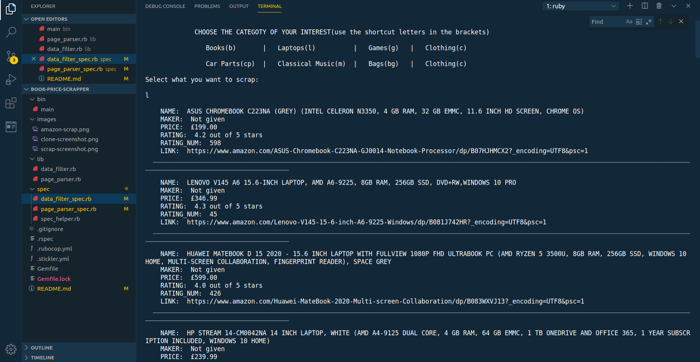
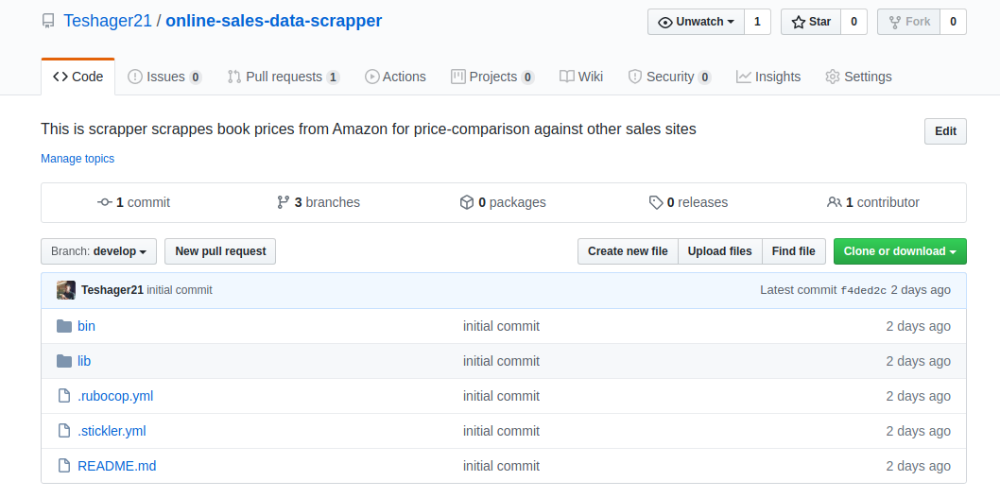

# Amazon Best Selling Products Data Scraper

In this project, I wrote a script that scrapes data from Amazon webpage using ruby. The main goal of this project is to create an effective ruby code that solves real life problem. The project is used to demonstrate a complete project building skill utilizing git-flow, unit-testing, file organisation and leverage of best practices while underscoring softskills like the ability to mulittask and transform a business requirement into a software solution.

## Built With

- Ruby-2.5.1p57
- nokogiri
- httparty

## How to use this scrapper

1. Make sure you have ruby installed
     Type `ruby --version` and see if you get the version number.
     If you don't have ruby installed use [this](https://www.tutorialspoint.com/ruby-on-rails/rails-installation.htm) link to know how to install it.
2. Type `install bundle` and press enter to install dependencies
3.From the bin folder right click on the main file and select the open with the terminal option
4. Type `ruby main` to run it
5. Select the catergory of product you will like to scrap by typing the shortcuts within the parenthesis
6. Press e to exit or stop scrapping 

### How to install using Command line

    1. Click on the install or download button under the repository name and grab the url
    by clicking on the clipboard icon

    2.open your terminal

    3.Navigate to the location in your computer where you want the repo to be cloned

    4. Type git clone  and paste the url you copied on step one.

        $ git clone https://github.com/YOUR-USERNAME/YOUR-REPOSITORY

    5. Press Enter. Your local clone will be created.

                $ git clone https://github.com/YOUR-USERNAME/YOUR-REPOSITORY
                > Cloning into `Spoon-Knife`...
                > remote: Counting objects: 10, done.
                > remote: Compressing objects: 100% (8/8), done.
                > remove: Total 10 (delta 1), reused 10 (delta 1)
                > Unpacking objects: 100% (10/10), done.

## Authors

👤 **Author**

- Gmail: [Teshager Admasu](mailto:teshager8922@gmail.com)
- Github: [@teshager21](https://github.com/teshager21)
- Twitter: [@Teshage84907805](https://twitter.com/Teshage84907805)
- Linkedin: [Teshager Admasu](https://www.linkedin.com/in/teshager-admasu-0000011a2/)

## 🤝 Contributing

    Contributions, issues and feature requests are welcome!

Feel free to check the [issues page](https://github.com/Teshager21/online-sales-data-scrapper/issues).

## Show your support

Give a ⭐️ if you like this project!

## Acknowledgments

- [Microverse](https://www.microverse.org/)
- [Odin Project](https://www.theodinproject.com//)
- [Github](https://github.com/)

## 📝 License

This project is [MIT](lic.url) licensed.